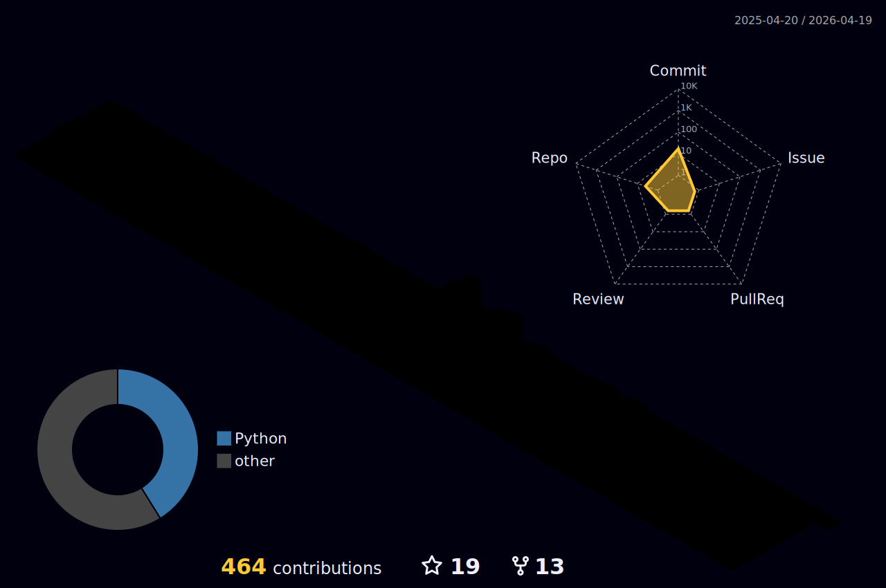

### 👋 Hi there

有时候想象自己并不是一个IT男，尽管身处IT工作之中，但是更多时候却又喜欢以一种跳出去回望这个群体的样子，常常别有一番滋味。

曾经在高中的时候，酷爱读书，读《论语》的时候看到这样一则故事：司马牛忧曰："人皆有兄弟，我独亡！"子夏曰："商闻之矣：死生有命，富贵在天。君子敬而无失，与人恭而有礼，四海之内，皆兄弟也。君子何患乎无兄弟也？"（司马牛担忧地说："别人都有兄弟，只有我没有。"子夏说："我听说过：`死生有命，富贵在天`，君子只要严肃认真地对待所做的事情，不出过失，对人恭敬而合乎于礼的规定，那`天下人就都是自家兄弟`。君子何愁没有兄弟呢？"）

而我，在这样一个伟大的时代中，与司马牛是一样的，在没看到四海皆兄弟这个概念之前也与司马牛一样有过类似忧虑。但是彼时就是这么一句话，瞬间点醒一个人，让我的心境进入到另一种天地。

讲个小故事，大概简单想表达几个简单意思：

- 1，古代朱子有云：`天不生仲尼，万古如长夜`，虽然现在距离孔子时代过去两千多年，但是对圣人的敬仰，感恩之心情，永不更易。这是对自己的要求，信而好古，永远秉持发扬优良传统文化，不亦快哉！
- 2，人的痛苦很大部分来源于`迷`（愚痴），而真心谛听的往往阅经猛醒，以致破迷开悟，离苦得乐。希望自己认真做一个传承者，学到的，内化的，分享的，与人有益，幸甚！
- 3，我也是一个喜欢交友的人，对待任何一个熟悉的陌生的，都"恭而有礼"，也希望借此能够结交更多的朋友。

### 🧰 语言工具

### 💻 Stats

点击展开 ...

<!-- <picture>
  <source
    media="(prefers-color-scheme: dark)"
    srcset="images/breakout-dark.svg"
  />
  <source
    media="(prefers-color-scheme: light)"
    srcset="images/breakout-light.svg"
  />
  
</picture> -->

### 🥇 Badges

<!-- my-badges start -->

<!-- my-badges end -->

